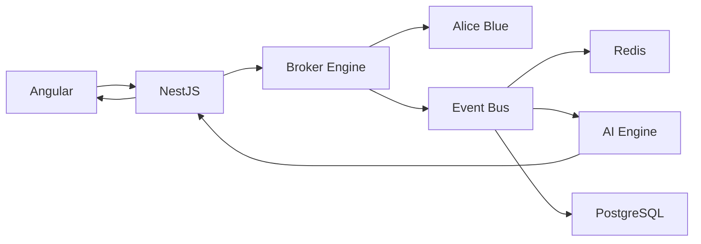
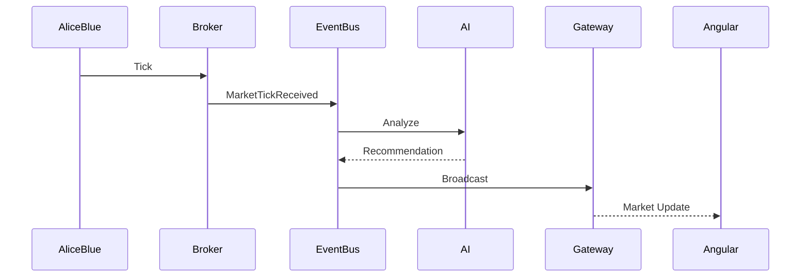

# System Architecture

```mermaid
flowchart LR
A[Angular] --> B[NestJS]
B --> C[Broker Engine]
C --> D[Alice Blue]
C --> E[Event Bus]
E --> F[Redis]
E --> G[AI Engine]
E --> H[PostgreSQL]
G --> B
B --> A
```

# Sequence Diagram

```mermaid
sequenceDiagram
AliceBlue->>Broker: Tick
Broker->>EventBus: MarketTickReceived
EventBus->>AI: Analyze
AI-->>EventBus: Recommendation
EventBus->>Gateway: Broadcast
Gateway-->>Angular: Market Update
```
