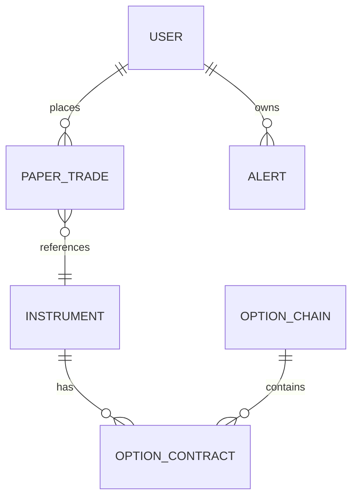

# Database ER Diagram

```mermaid
erDiagram
USER ||--o{ PAPER_TRADE : places
USER ||--o{ ALERT : owns
PAPER_TRADE }o--|| INSTRUMENT : references
INSTRUMENT ||--o{ OPTION_CONTRACT : has
OPTION_CHAIN ||--o{ OPTION_CONTRACT : contains
```
